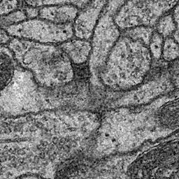
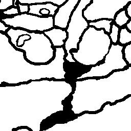
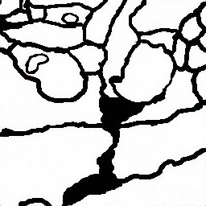
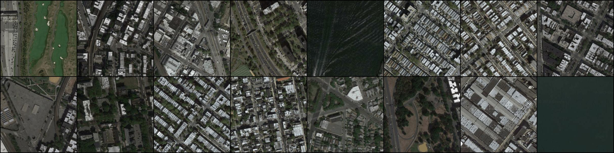
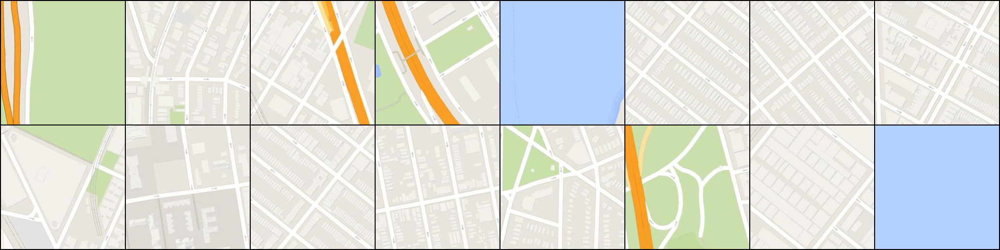

# FusionNet_Pytorch

[FusionNet: A deep fully residual convolutional neural network for image segmentation in connectomics](https://arxiv.org/abs/1612.05360)

## Requirements

- Pytorch 0.1.11
- Python 3.5.2
- wget

## Download code

~~~
git clone https://github.com/GunhoChoi/FusionNet_Pytorch
cd FusionNet_Pytorch
~~~

## Download Map data

~~~
wget https://people.eecs.berkeley.edu/~tinghuiz/projects/pix2pix/datasets/maps.tar.gz
tar -xzvf maps.tar.gz
~~~

## Make model directory

~~~
mkdir model
~~~

## Train Model
~~~
python3 main.py  -> medical image without augmentation
python3 main_augmented.py  -> map image with naive augmentation
~~~
Out of memory error -> change batch_size / img_size / out_dim

## Result

### Medical Image

### Map Image 

Original Image / Label Image / Generated Image

## Related Works

- [FusionNet in Tensorflow by Hyungjoo Andrew Cho](https://github.com/NySunShine/fusion-net)
